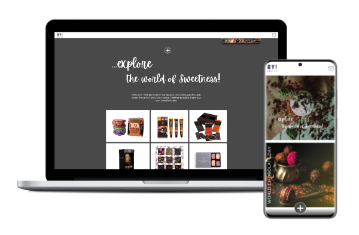

# AY Sweets!

## About The Project

A PERN stack CRUD application for users to view and contribute their recommendations.

### Demo: https://ay-choc-front.onrender.com/

### Features

Users are able to:

- Experience responsive design for various devices
- View hover states for all interactive elements on the page for laptops
- View recommendations
- Add their own recommendations
- Edit recommendations
- Delete recommendations
- View links to product websites

(<a href="#readme-top">back to top</a>)

### Languages & tools

- Postges
- Node
- Express
- React
- Javascript
- Render
- HTML
- CSS
- Canva
- Postman
